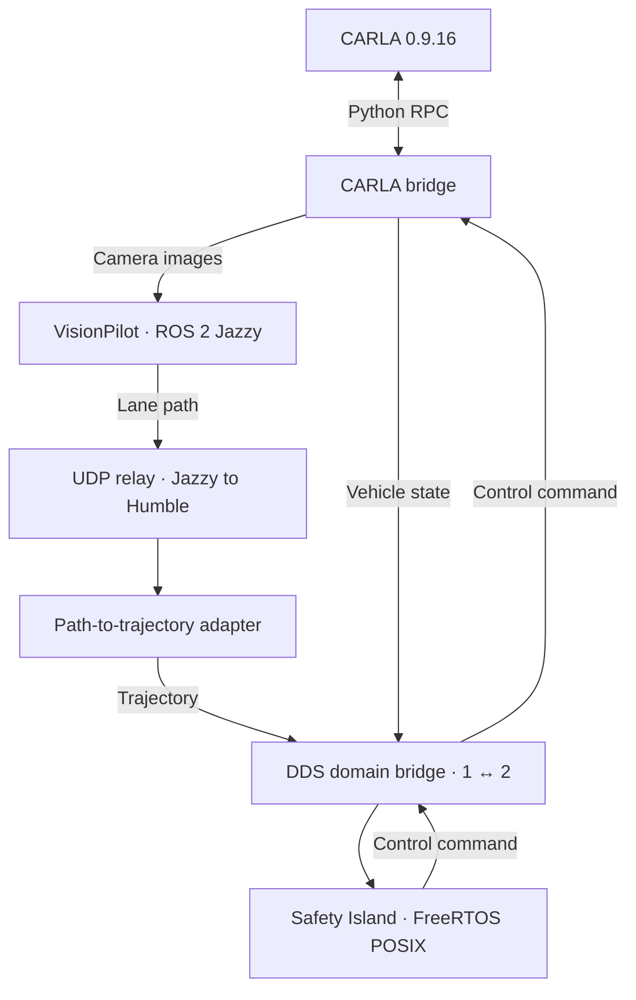

# openadkit-e2e

An Open AD Kit deployment for L2 closed-loop simulation:
**VisionPilot plans, Autoware Safety Island controls, and CARLA simulates.**

The stack runs with Docker Compose. This repo provides the deployment, configuration,
and adapter that connects VisionPilot's lane path to Safety Island's trajectory follower.

## How it works



Safety Island is the only controller; VisionPilot's steering and throttle commands
are not connected to CARLA. A scenario process creates the vehicle and sensors and
advances the simulation at a requested 20 Hz, with camera images at 10 Hz.

## Quick start

Use an Ubuntu x86-64 host with a working NVIDIA driver, Git, curl, and Python 3.10
with venv support. Run these commands from the repository root:

```bash
./deploy/setup.sh
# Log out and back in if setup asks you to.
./deploy/build.sh --dds-interface ens3
./deploy/run-loop.sh
```

Replace `ens3` with your multicast-capable network interface. The build script
initializes the required submodules and builds the GPU stack.

Open the **[camera preview](http://127.0.0.1:8090/)** once the loop is ready.
See the **[deployment guide](deploy/README.md)** for configuration, logs, and shutdown.

## Known limitation

In Town04, VisionPilot can switch between lanes at splits and merges, causing
weaving or Safety Island `too large yaw error` messages. An empty path produces
a stop trajectory, and the vehicle can remain stopped. The adapter does not
correct this path-selection limitation.

## Repository

| Path | Contents |
| --- | --- |
| [`deploy/`](deploy/README.md) | Setup, build, Compose services, and runtime configuration |
| [`adapter/`](adapter/path_to_trajectory.py) | Lane path → Autoware trajectory conversion |
| [`upstream/vision_pilot`](https://github.com/oguzkaganozt/autoware_vision_pilot/tree/feat/lane-path) | VisionPilot fork that publishes `/vehicle/lane_path` |
| [`upstream/autoware-safety-island`](https://github.com/autowarefoundation/autoware-safety-island) | Pinned Safety Island submodule |

CARLA uses the `carlasim/carla:0.9.16` container image and its Python API.
Native ROS integration (`--ros2`) is disabled.
