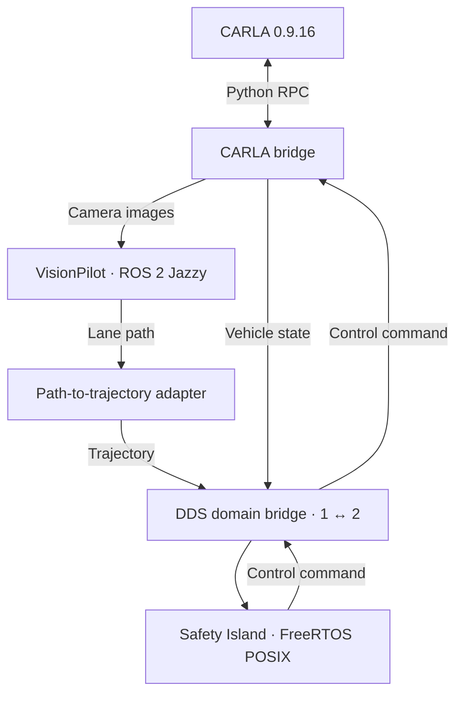

# openadkit-e2e

> **Open issue:** VisionPilot's own steering loop is not a usable CARLA
> baseline on this stack. VP publishes a usable lane path; SI follows that
> path. VP's tyre-angle / accel commands, wired straight to the same bridge,
> leave the lane within tens of metres (zero steer below 0.2 m/s, then ~0.002 rad
> at ~1 m CTE). Official VP has the same controller. Do not treat vanilla
> VP→CARLA as the gold A/B. Compare SI+fixed 3 m/s vs SI+VP speed intent.
> See [Known limitations](#visionpilots-own-steering-is-not-a-carla-baseline).

An Open AD Kit deployment for L2 closed-loop simulation:
**VisionPilot plans, Autoware Safety Island controls, and CARLA simulates.**

The stack runs with Docker Compose. This repo provides the deployment, configuration,
and adapter that connects VisionPilot's lane path to Safety Island's trajectory follower.

## How it works



Safety Island is the only controller; VisionPilot's steering and throttle commands
are not connected to CARLA. A scenario process creates the vehicle and sensors and
advances the simulation at a requested 20 Hz, with camera images at 10 Hz.

## Quick start

Use an Ubuntu x86-64 host with a working NVIDIA driver, Git, curl, and Python 3.10
with venv support (CARLA itself still requires an NVIDIA GPU; see
[compute mode](deploy/README.md#compute-mode-gpu-or-cpu) for CPU inference notes).
Run these commands from the repository root:

```bash
./deploy/setup.sh
# Log out and back in if setup asks you to.
./deploy/build.sh --dds-interface ens3
./deploy/run-loop.sh
```

Replace `ens3` with your multicast-capable network interface. The build script
initializes the required submodules and builds the stack.

Once the loop is ready, open the camera preview: <http://127.0.0.1:8090/>
(On a remote host, use the public-IP link printed by `run-loop.sh`.)

See the [deployment guide](deploy/README.md) for configuration, logs, and shutdown.

## Known limitations

### VisionPilot's own steering is not a CARLA baseline

The closed loop in this repo is **path → SI follower**, not VP actuators.
A throwaway VP→`Control` shim on the current bridge (Town04 spawn 184)
confirms: VP steering stays ~0 at launch (`v < 0.2 m/s` returns zeros in
the lateral planner; same in official `autowarefoundation/vision_pilot`)
and stays ~0.002 rad with ~1 m cross-track error after the car is on the
shoulder. Snapping spawn to the lane waypoint does not change heading
(already 89.9°). SI following `/vehicle/lane_path` at 3 m/s drives
hundreds of metres on the same spawn.

Until that controller is a separate, working loop, A/B for integration is
SI+nominal 3 m/s vs SI+VP speed intent — not vanilla VP steering.

### A/B baseline: SI+VP speed vs SI+3 m/s (empty road, 2026-09-11)

Historical: this ran on the pre-`DrivingReference` adapter
(`lane_path`/`speed_horizon`, removed); reproduce B from commit `25aa746`.
Town04 spawn 184, no lead, no NPCs (`RIG_JSON=carla-rig-empty.json`;
B adds `CRUISE_OVERRIDE_MPS=3.0`). Same road, same stack, 1 Hz
ground-truth pose + lane-offset log. Shared segment t=40–95 s:

| condition | mean v | max v | mean \|lane_off\| | max \|lane_off\| | dist |
|---|---|---|---|---|---|
| A: VP speed | 12.9 m/s | 19.0 m/s | 0.12 m | 1.76 m | 713 m |
| B: flat 3 m/s | 2.95 m/s | 3.27 m/s | 0.02 m | 0.04 m | 162 m |

Read: the pipeline carries either speed program faithfully (B holds
3 m/s to ±0.3; A reaches 21 m/s with 9 cm mean tracking). The lateral
limit is VP's own path at speed — A cuts an S-curve at 17.6 m/s
(+1.76 m excursion, recovered), B never exceeds 4 cm. A then left the
highway at a split at ~17 m/s and beached in the grass (guardrail
contact, photos on record); B drove 632 m clean, then VP lost the lane
in a fork (empty Path) and the adapter's ingress gate held the car
on-road with zero contact (see below). So: longitudinal fidelity proven
at both speeds; both runs ended on VP lateral limits, not the pipeline.

### Fault policy moved to the Safety Island (SI #62)

The predecessor policy answered stale/missing/late input with an
adapter-authored zero-speed trajectory. That is retired: an adapter-made
stop would refresh SI's selected input and mask the fault SI must see.
The adapter now accepts only a valid reference whose `source_stamp`
matches an ego sample exactly (same CARLA world frame) and publishes
nothing otherwise, with counted reject reasons
(`reject <reason> (totals ...)`). Source freshness watchdogs and the stop
decision are SI work (`autoware-safety-island` #62/#64): proposed first
thresholds are 1.0 s for the VP outputs and the camera and 0.3–0.5 s for
the 20 Hz ego/speed feedback, with the agreed 500 ms
fault-detection → first applied CARLA braking frame gate. Measured max VP
output gap is 682 ms, so a 0.5 s VP watchdog would false-trip.

Live evidence (run B) from the predecessor policy stays useful as
baseline behavior: two ~2 s VP input dropouts mid-cruise each answered
with a brief conservative dip (3→~1 m/s, on-lane, full recovery, SI never
left DRIVE); when VP lost the lane outright at the fork, the gate held
the car stopped on-road for 4+ minutes, SI in STOPPED hold, zero
collisions. Under the new contract the same dropouts are SI-detected
(source watchdog → SI stop), not adapter-synthesized. One evidence gap
from those runs: per-container logs rotated before collection, so compose
now pins `max-size/max-file` logging so a full run's evidence survives.

### Unstable lead perception: flicker mid-range, blindness close-range

VisionPilot's lead (CIPO) signal is range-dependent and nondeterministic
across identical runs (measured confirm rates between ~3% and ~96% of
frames on the Town04 lead rig, with ground-truth gap + collision sensor
+ per-frame fusion logs):

- **30–70 m:** AutoDrive and AutoSpeed fuse (redundant). AutoDrive never
  confirms below ~30 m (`flag_prob` stays under 0.40 all the way in).
- **8–30 m:** AutoSpeed detector alone. Tracks, but flickers run to run,
  and mono-depth overreads by ~+5–16 m mid-range.
- **Below ~8 m:** both networks drop it — the bbox bottom (the homography
  reference) exits the frame bottom (`y2=512`); the bumper fills the
  frame. Fusion then reports 150 m free-road
  (`longitudinal_fusion.cpp`, no-confirm branch), IDM commands
  +1.5 m/s², and the pipeline — which transcribes VP intent 1:1 —
  honestly executes it into the bumper (measured contacts at 0.8–5 m/s).
- **Ghosts:** single-frame ~10–11 m re-confirms amid drops.
- One run showed total blindness (zero confirms at any range); cause is
  open (possibly model warmup — VP missed the first ~60 sim-s). Camera
  frames were healthy daylight throughout (1 fps snapshots on record).

Mitigation in tree: the CIPO latch on `feat/lane-path` (v7) arms on
track *rate* (10/60 frames — flaky-but-real tracks arm, 1–2-frame
ghosts cannot), feeds the planner a hold model (`min(coast, 2 m)` as
stopped, honest coast outside 8 m — never raw flicker), releases on 5
trusted + plausible confirms, and force-releases after 40 m of blind
roll. Verified 2026-09-11: approach at ~9 m/s, stop, hold at ~7 m true
gap, **zero collisions**, SI smooth-stop engaged.

Consequence: the car now holds *short* instead of creeping to 2 m —
the creep-to-2 m mission still needs real close-range detection
(truncated-bbox handling, homography bias calibration, or a proximity
source), and no safety claim rests on this scenario until then
(guard/MRM phase).

### Lateral cold-start swerve at launch

The hero spawns exactly on the lane center (scenario snaps the spawn to
the lane waypoint), yet VP's first cross-track estimates read ±1.0–1.7 m
(sign flips run to run — estimate noise, not geometry) and converge
within seconds. SI tracks the path, so the car visibly throws itself
sideways on launch; once it grazed the right guardrail (~0.65 m/s,
Town04 spawn 184). Upstream lateral warmup/confidence gating would fix
it (the predecessor adapter held on an empty path; the new one rejects
the reference and lets SI answer); untouched so far.

### Lane changes at Town04 splits and merges

VisionPilot can switch between lanes at splits and merges, causing
weaving or Safety Island `too large yaw error` messages. An invalid or
empty reference is rejected (no adapter-authored stop); with no fresh
input SI's selected-source watchdog takes over. The adapter does not
correct this path-selection limitation.

### Cross-distro, cross-RMW reference subscription

The adapter subscribes to VisionPilot's `/vehicle/driving_reference`
(`visionpilot_msgs`, from the fork) directly across the ROS distro (Jazzy
to Humble) and RMW (FastDDS to CycloneDDS) boundary. `nav_msgs/Path` was
verified empirically at 10 Hz here including a full closed loop, but ROS
guarantees neither cross-distro nor cross-vendor communication. If the
adapter stops publishing trajectories while VisionPilot is planning,
suspect this boundary first (see also
[rmw_fastrtps#797](https://github.com/ros2/rmw_fastrtps/issues/797)). The
compound type is small (a few hundred bytes) with reliable depth-1 QoS,
far easier than the 7 MB image path, and the Humble-side binding is built
into the adapter image from the same package sources
(`deploy/images/adapter.Dockerfile`). Unifying both sides on CycloneDDS
was tested and does not work (rmw 1.x vs 2.x string deserialization
mismatch), so keep VisionPilot on its default FastDDS.

### CARLA requires an NVIDIA GPU

There is no supported CPU rendering path. UE 4.26 is Vulkan-only (`-opengl`
is ignored), the bundled Mesa 21.2 lavapipe segfaults during init,
host-mounted Mesa 23 cannot load (glibc 2.32+ vs image 2.31), and
`-no-rendering` crashes the same way at startup. Even if it booted,
no-rendering returns empty camera data, which would blind the planner.

CPU inference tops out around 2.5 Hz on a 28-core EPYC (vs 10 Hz on GPU);
the loop stays correct because the scenario drives sim time. Measurements,
in order:

- ORT graph optimizations on CPU sessions gained ~20% (kept).
- INT8 weights were slower than fp32 in testing (1.8 vs 2.5 Hz on the same host,
  reverted — the test CPU lacks the VNNI instructions INT8 needs, so it could not
  be fairly evaluated).
- Pinning to 8/25/28 cores showed parallelism saturates early, so thread tuning has nothing to give.
- Skipping the unused autospeed model (~1/3 of DNN cost) was deliberately left out to avoid touching the planner.

All CPU figures above were measured on x86-64 (AMD EPYC); ARM CPU runs are
untested and pending.

## Next steps

See the [VP–SI integration plan](docs/vp-si-integration-plan.md) for the staged
implementation: rich motion reference, supervisor gate, and environmental supervision.

### ARM validation

- Validate CPU inference on ARM hosts, which are currently untested; record
  planning rate and loop behavior the same way the x86-64 figures above were measured.

### Remote / multi-host

- Add a `CARLA_HOST` knob so the scenario and bridge can target a remote CARLA
  server instead of the hardcoded `127.0.0.1`, and document the required
  DDS/network setup.

### Planner and inference

- Re-evaluate INT8 on a VNNI-capable CPU; current figures come from a CPU
  without the VNNI instructions INT8 needs.
- Revisit skipping the unused autospeed model (~1/3 of DNN cost) if planner
  changes allow it.

### Interoperability

- Harden lane selection at splits and merges; the adapter currently passes
  VisionPilot's path through uncorrected.
- Reduce reliance on the cross-distro (Jazzy ↔ Humble), cross-RMW
  (FastDDS ↔ CycloneDDS) path subscription once the string deserialization
  mismatch is resolved.

### Generalization

- Parameterize the town: the scenario currently hardcodes `Town04`
  (`deploy/nodes/scenario.py`); make it configurable and validate additional
  maps and spawn points.
- Extend NPC traffic scenarios beyond the current rig, which configures none
  (`deploy/config/carla-rig.json`).

## Repository

| Path                                                                                                              | Contents                                                        |
| ----------------------------------------------------------------------------------------------------------------- | --------------------------------------------------------------- |
| [`deploy/`](deploy/README.md)                                                                                     | Setup, build, Compose services, and runtime configuration       |
| [`adapter/`](adapter/path_to_trajectory.py)                                                                       | VP driving reference → Autoware trajectory conversion           |
| [`upstream/vision_pilot`](https://github.com/oguzkaganozt/autoware_vision_pilot/tree/feat/vp-si-interface)         | VisionPilot fork publishing `/vehicle/driving_{command,reference}` |
| [`upstream/autoware-safety-island`](https://github.com/autowarefoundation/autoware-safety-island)                  | Pinned Safety Island submodule                                  |

CARLA uses the `carlasim/carla:0.9.16` container image and its Python API.
Native ROS integration (`--ros2`) is disabled.
