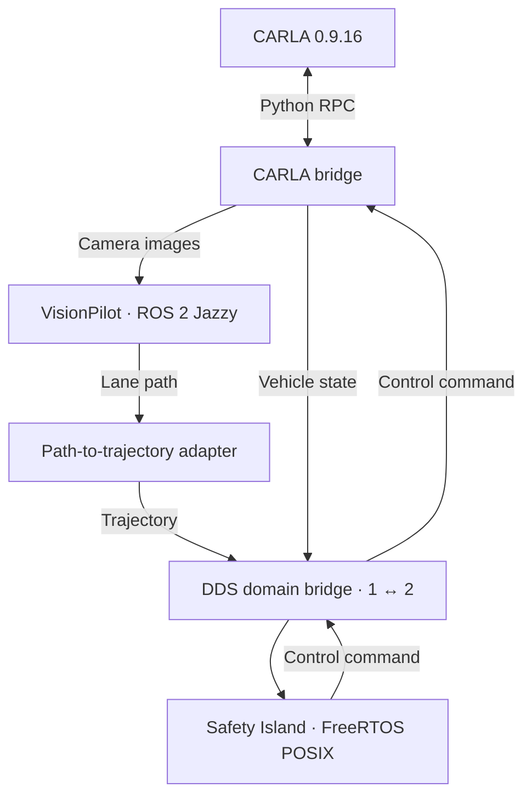

# openadkit-e2e

L2 closed-loop simulation: **VisionPilot plans, Safety Island controls, CARLA simulates.**

> [!IMPORTANT]
> VisionPilot's own steering is **not** a CARLA baseline here.
> VisionPilot publishes a usable lane path, Safety Island follows it.
> Wiring VisionPilot's steering / throttle straight to CARLA leaves the lane
> within tens of metres. Compare **SI + fixed 3 m/s** vs **SI + VP speed intent**.
> Details in [Known limitations](#known-limitations).

Docker Compose stack. This repo provides the deployment, configuration,
and adapter that connects VisionPilot's lane path to Safety Island's
trajectory follower.

## Contents

- [How it works](#how-it-works)
- [Quick start](#quick-start)
- [Known limitations](#known-limitations)
- [Next steps](#next-steps)
- [Repository](#repository)

## How it works



- **VisionPilot** outputs a lane path (`/vehicle/lane_path`).
  Its steering / throttle commands are **not** connected.
- **Adapter** converts that path to a Safety Island trajectory.
- **Safety Island** is the only controller.
- **Scenario process** spawns the vehicle and sensors, steps simulation
  at 20 Hz, with camera images at 10 Hz.

## Quick start

**Prerequisites:** Ubuntu x86-64 host with NVIDIA driver, Git, curl,
and Python 3.10 with venv support.

> CARLA itself still needs an NVIDIA GPU.
> See [compute mode](deploy/README.md#compute-mode-gpu-or-cpu) for CPU inference notes.

From the repository root:

```bash
./deploy/setup.sh
# Log out and back in if setup asks you to.
./deploy/build.sh --dds-interface ens3
./deploy/run.sh
```

- Replace `ens3` with your multicast-capable network interface.
- `build.sh` initializes submodules and builds the stack.
- Camera preview: <http://127.0.0.1:8090/>
  (on a remote host, use the public-IP link printed by `run.sh`).

See the [deployment guide](deploy/README.md) for configuration, logs, and shutdown.

## Known limitations

### VisionPilot's own steering is not a CARLA baseline

The closed loop here is **path → SI follower**, not VP actuators.

A throwaway VP → `Control` shim on the current bridge (Town04 spawn 184) showed:

- At launch, VP steering stays ~0 (`v < 0.2 m/s` returns zeros in the
  lateral planner; same in official `autowarefoundation/vision_pilot`).
- Once moving, steering stays ~0.002 rad despite ~1 m cross-track error.
- Snapping spawn to the lane waypoint does not help — heading is already 89.9°.
- SI following `/vehicle/lane_path` at 3 m/s drives hundreds of metres
  from the same spawn.

So for integration A/B, use **SI + nominal 3 m/s vs SI + VP speed intent**,
not vanilla VP steering.

### A/B baseline: SI+VP speed vs SI+3 m/s (empty road, 2026-09-11)

Setup: Town04 spawn 184, no lead, no NPCs (`RIG_JSON=carla-rig-empty.json`;
B adds `CRUISE_OVERRIDE_MPS=3.0`). Same road, same stack, 1 Hz
ground-truth pose + lane-offset log. Shared segment t=40–95 s.

| condition | mean v | max v | mean \|lane_off\| | max \|lane_off\| | dist |
|---|---|---|---|---|---|
| A: VP speed | 12.9 m/s | 19.0 m/s | 0.12 m | 1.76 m | 713 m |
| B: flat 3 m/s | 2.95 m/s | 3.27 m/s | 0.02 m | 0.04 m | 162 m |

What this means:

- Longitudinal fidelity is proven at both speeds: B holds 3 m/s to ±0.3;
  A reaches 21 m/s with 9 cm mean tracking.
- The lateral limit is VP's own path at speed: A cut an S-curve at
  17.6 m/s (+1.76 m excursion, recovered); B never exceeded 4 cm.
- A then left the highway at a split (~17 m/s) and beached in the grass
  (guardrail contact, photos on record).
- B drove 632 m clean, then VP lost the lane in a fork (empty Path) and
  the adapter's ingress gate held the car on-road with zero contact.

Both runs ended on VP lateral limits, not the pipeline.

### Phase 1 ingress: stop on bad input, silence on a horizon blip

SI latches its last trajectory (`has_trajectory_` never clears). The
adapter gates input on age (`STALE_INPUT_MS=1000`, >3x the worst healthy
270 ms sample):

- Startup: no Path yet → 0 m/s stop (`watchdog-no-path`).
- Explicit stop (`stop #N reason=...`): missing horizon, stale/missing
  odom, empty path, bad shape.
- Stale horizon, or Path silence after the first Path: publish nothing.
  SI keeps the last trajectory. Replaying the last speed onto a new Path
  is forbidden; a 1 s stop on a DDS blip latched the follower in STOPPED.
- Unit tests cover late, dropped, restarted, and bad-shape inputs.
  There is no sequence on this wire, so the policy is age-only by design.

Live evidence (run B):

- Two ~2 s VP input dropouts mid-cruise each caused a brief,
  conservative dip (3 → ~1 m/s, on-lane, full recovery, SI never left DRIVE).
  VP's planning loop never stalled, so the dips trace to brief
  input-side stalls met by the gate.
- When VP lost the lane outright at the fork, the gate held the car
  stopped on-road for 4+ minutes (SI in STOPPED hold, zero collisions).

One evidence gap: per-container logs rotated before collection, so the
dip onsets lack transfer traces. Compose now pins `max-size` / `max-file`
logging so a full run's evidence survives (applies from the next recreate).

### Phase 2 guard: native in Safety Island

The output guard lives inside `actuation_freertos`
(same policy as the retired Python prototype).

- States: `INIT → FRESH ↔ COMFORTABLE → EMERGENCY → HOLD → FRESH`.
- Traj silent under 3 s stays FRESH (SI keeps the last plan). After 3 s,
  COMFORTABLE publishes a mild decel (`a≈-0.8`, last speed, last steer).
  Emergency publishes a hard brake (`v=0`, `a=-3`) on
  `/control/trajectory_follower/control_cmd`. HOLD is emergency-only.
- `HOLD` needs an explicit `/guard/re_enable` pulse (Float64 > 0.5)
  plus a cleared fault.
- Coupled envelope: 1.2x of +4.0 / −6.0 m/s² longitudinal, 3.0 lateral.

On/off:

- **Compile-time (Zephyr + FreeRTOS):** `CONFIG_GUARD_ENABLE` in
  `actuation_module/Kconfig`, default on.
  `./build.sh --platform freertos-posix --guard off`
  (or Zephyr extra conf `boards/guard_off.conf`).
  Hardware on/off is a new image.
- **Boot-time (POSIX sim only):** `GUARD=0` disables a compiled-in guard;
  `GUARD=1` cannot enable a `--guard off` build.
  Compose: `GUARD=${GUARD:-1}` on the `si` service.
- **Run mode:** `MODE=run|autoware|stop` (compile `CONFIG_SI_MODE`,
  default `run`). `run` always follows; `autoware` reads Universe
  `/system/operation_mode/state`; `stop` is not under control.

Limits: SI process death is still the bridge 0.5 s timeout — the guard
cannot outlive its process. No crash-avoidance claim; same-chain checks
cannot confirm perception truth (Phase 3).

### Unstable lead perception: flicker mid-range, blindness close-range

VisionPilot's lead (CIPO) signal is range-dependent and nondeterministic
across identical runs (measured confirm rates ~3% to ~96% of frames on
the Town04 lead rig, with ground-truth gap + collision sensor +
per-frame fusion logs):

- **30–70 m:** AutoDrive and AutoSpeed fuse (redundant). AutoDrive never
  confirms below ~30 m (`flag_prob` stays under 0.40 all the way in).
- **8–30 m:** AutoSpeed detector alone. Tracks, but flickers run to run,
  and mono-depth overreads by ~+5–16 m mid-range.
- **Below ~8 m:** both networks drop it — the bbox bottom (the homography
  reference) exits the frame bottom (`y2=512`); the bumper fills the frame.
  Fusion then reports 150 m free-road (`longitudinal_fusion.cpp`,
  no-confirm branch), IDM commands +1.5 m/s², and the pipeline — which
  transcribes VP intent 1:1 — executes it into the bumper
  (measured contacts at 0.8–5 m/s).
- **Ghosts:** single-frame ~10–11 m re-confirms amid drops.
- One run showed total blindness (zero confirms at any range); cause is
  open (possibly model warmup — VP missed the first ~60 sim-s).
  Camera frames were healthy daylight throughout (1 fps snapshots on record).

Mitigation in tree (CIPO latch on `feat/lane-path`, v7):

- Arms on track *rate* (10/60 frames — flaky-but-real tracks arm,
  1–2-frame ghosts cannot).
- Feeds the planner a hold model (`min(coast, 2 m)` as stopped,
  honest coast outside 8 m — never raw flicker).
- Releases on 5 trusted + plausible confirms; force-releases after 40 m
  of blind roll.
- Verified 2026-09-11: approach at ~9 m/s, stop, hold at ~7 m true gap,
  **zero collisions**, SI smooth-stop engaged.

Consequence: the car now holds *short* instead of creeping to 2 m.
Creep-to-2 m still needs real close-range detection (truncated-bbox
handling, homography bias calibration, or a proximity source), and no
safety claim rests on this scenario until then (guard/MRM phase).

### Lateral cold-start swerve at launch

The hero spawns exactly on the lane center (scenario snaps the spawn to
the lane waypoint), yet VP's first cross-track estimates read ±1.0–1.7 m
(sign flips run to run — estimate noise, not geometry) and converge
within seconds.

SI tracks the path, so the car visibly throws itself sideways on launch;
once it grazed the right guardrail (~0.65 m/s, Town04 spawn 184).
Upstream lateral warmup / confidence gating would fix this
(the adapter already holds on an empty path); untouched so far.

### Lane changes at Town04 splits and merges

VisionPilot can switch between lanes at splits and merges, causing
weaving or Safety Island `too large yaw error` messages. An empty path
produces a stop trajectory, and the vehicle can remain stopped.
The adapter does not correct this path-selection limitation.

### Cross-distro, cross-RMW path subscription

The adapter subscribes to VisionPilot's `/vehicle/lane_path` directly
across the ROS distro (Jazzy to Humble) and RMW (FastDDS to CycloneDDS)
boundary.

This was verified empirically for `nav_msgs/Path` at 10 Hz, including a
full closed loop, but ROS guarantees neither cross-distro nor
cross-vendor communication. If the adapter stops publishing trajectories
while VisionPilot is planning, suspect this boundary first
(see also [rmw_fastrtps#797](https://github.com/ros2/rmw_fastrtps/issues/797)).

Unifying both sides on CycloneDDS was tested and does not work
(rmw 1.x vs 2.x string deserialization mismatch), so keep VisionPilot
on its default FastDDS.

### CARLA requires an NVIDIA GPU

There is no supported CPU rendering path:

- UE 4.26 is Vulkan-only (`-opengl` is ignored).
- Bundled Mesa 21.2 lavapipe segfaults during init.
- Host-mounted Mesa 23 cannot load (glibc 2.32+ vs image 2.31).
- `-no-rendering` crashes the same way at startup.
- Even if it booted, no-rendering returns empty camera data,
  which would blind the planner.

CPU inference tops out around 2.5 Hz on a 28-core EPYC (vs 10 Hz on GPU);
the loop stays correct because the scenario drives sim time.
Measurements, in order:

- ORT graph optimizations on CPU sessions gained ~20% (kept).
- INT8 weights were slower than fp32 in testing (1.8 vs 2.5 Hz on the
  same host, reverted — the test CPU lacks the VNNI instructions INT8
  needs, so it could not be fairly evaluated).
- Pinning to 8/25/28 cores showed parallelism saturates early,
  so thread tuning has nothing to give.
- Skipping the unused autospeed model (~1/3 of DNN cost) was deliberately
  left out to avoid touching the planner.

All CPU figures above were measured on x86-64 (AMD EPYC); ARM CPU runs
are untested and pending.

## Next steps

See the [VP–SI integration plan](docs/vp-si-integration-plan.md) for the staged
implementation: rich motion reference, supervisor gate, and environmental supervision.

- **ARM validation:** validate CPU inference on ARM hosts (currently
  untested); record planning rate and loop behavior the same way the
  x86-64 figures above were measured.
- **Remote / multi-host:** add a `CARLA_HOST` knob so the scenario and
  bridge can target a remote CARLA server instead of the hardcoded
  `127.0.0.1`, and document the required DDS/network setup.
- **Planner and inference:**
  - Re-evaluate INT8 on a VNNI-capable CPU; current figures come from a
    CPU without VNNI.
  - Revisit skipping the unused autospeed model (~1/3 of DNN cost) if
    planner changes allow it.
- **Interoperability:**
  - Harden lane selection at splits and merges; the adapter currently
    passes VisionPilot's path through uncorrected.
  - Reduce reliance on the cross-distro (Jazzy ↔ Humble), cross-RMW
    (FastDDS ↔ CycloneDDS) path subscription once the string
    deserialization mismatch is resolved.
- **Generalization:**
  - Parameterize the town: the scenario currently hardcodes `Town04`
    (`deploy/nodes/scenario.py`); make it configurable and validate
    additional maps and spawn points.
  - Extend NPC traffic beyond the default lead-plus-NPC rig
    (`deploy/config/carla-rig.json`). Empty-road A/B runs use
    `RIG_JSON=carla-rig-empty.json`.

## Repository

| Path | Contents |
| --- | --- |
| [`deploy/`](deploy/README.md) | Setup, build, Compose services, and runtime configuration |
| [`deploy/nodes/`](deploy/nodes/path_to_trajectory.py) | Adapter, CARLA bridge, scenario |
| [`tests/`](tests/) | Adapter unit tests and SI-only fake path |
| [`upstream/vision_pilot`](https://github.com/oguzkaganozt/autoware_vision_pilot/tree/feat/lane-path) | VisionPilot fork that publishes `/vehicle/lane_path` |
| [`upstream/autoware-safety-island`](https://github.com/autowarefoundation/autoware-safety-island) | Pinned Safety Island submodule |

CARLA uses the `carlasim/carla:0.9.16` container image and its Python API.
Native ROS integration (`--ros2`) is disabled.
