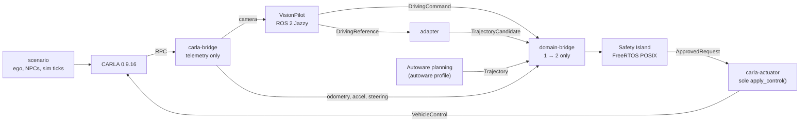

# openadkit-e2e

An Open AD Kit closed-loop rig for L2 simulation: **VisionPilot or Autoware
plans, the Autoware Safety Island decides, CARLA 0.9.16 simulates, and
exactly one process actuates.** Everything runs with Docker Compose; this repo
holds the deployment, configuration, the VisionPilot-to-SI adapter, and the
evidence.

## Status

| Area | State | Evidence |
| --- | --- | --- |
| SI ingress + 500 ms applied-stop gate (all three modes) | Done — gates 6–14 ms | [`docs/e2e2-stop-gate.md`](docs/e2e2-stop-gate.md) |
| SI latch / re-enable / VP restart identity checks | Done | [`docs/si-ingress-faults.md`](docs/si-ingress-faults.md) |
| VP input stalls | Fixed (host socket buffers) | findings 005, 012 |
| VP phantom braking (−7.5 m/s²) | Fixed (fork) | finding 011 |
| VP lane keeping at 9 m/s | Fixed weave (fork + confs); ~1.1 km runs, no contact | finding 013 |
| VP curve offset, junctions/ramps | **Open** | finding 013, [`todo.md`](todo.md) |

Findings: [`docs/vp-findings.md`](docs/vp-findings.md). Example clips:
[`docs/media/`](docs/media/README.md).

## How it works



- **Domains:** CARLA telemetry, VisionPilot, the adapter and Autoware use DDS
  domain 1; the SI and the actuator use domain 2. The domain bridge carries
  only the inputs listed in
  [`deploy/config/bridge-config.yaml`](deploy/config/bridge-config.yaml); no
  control topic goes back.
- **One SI binary, selected at startup:** `SI_MODE=si` (SI_CONTROL — the SI's
  own follower tracks the selected trajectory) or `SI_MODE=vp` (VP_CONTROL —
  the SI checks and passes VisionPilot's `DrivingCommand` through). The
  trajectory source is `RIG_MODE=vp|autoware`. Mode and source never change at
  run time; there is no fallback to the unselected planner.
- **Stops are SI-owned:** a stale or invalid selected source latches SI_STOP;
  clearing it needs an explicit `/control/safety_island/reenable` (`std_msgs/Bool`,
  domain 2) while every source is fresh. The adapter never authors a stop.
- **Actuation:** `carla-actuator` is the only caller of `apply_control()`. It
  applies the SI's decision each loop and realises the approved tire angle
  through the car's speed-dependent steering curve.

| `RIG_MODE` | `SI_MODE` | Who plans | Who follows |
| --- | --- | --- | --- |
| `vp` (default) | `si` (default) | VisionPilot lane path → adapter candidate | SI follower |
| `vp` | `vp` | VisionPilot command (steer, speed, accel) | VisionPilot, SI-checked |
| `autoware` | `si` | Autoware native trajectory (empty-scene fixture) | SI follower |

## Quick start

Ubuntu x86-64 with a working NVIDIA driver, Git, curl and Python 3.10 with
venv. From the repository root:

```bash
./deploy/setup.sh                        # Docker, NVIDIA runtime, DDS socket buffers
# Log out and back in if setup asks you to.
./deploy/tools/fetch-town04-map.sh       # only needed for the Autoware profile
./deploy/build.sh --dds-interface ens3   # submodules, images, SI binary, CARLA venv
./deploy/run-loop.sh --gpu               # one fresh-world VP → SI_CONTROL drive
```

Replace `ens3` with a multicast-capable interface. Open the camera preview at
<http://127.0.0.1:8090/> (a remote host prints its public link). Other modes
and knobs are in the [deployment guide](deploy/README.md).

`setup.sh` is not optional on a new host: VisionPilot receives 7.4 MB camera
frames over UDP, and with the stock 212 KB socket buffers it starves and the
SI latches (finding 012). `run-loop.sh` refuses to start without the larger
limits.

## Known limitations

- **VisionPilot lateral control (open).** At 9 m/s VP_CONTROL holds a steady
  offset of ~110 m × curvature in curves (≤ 0.8 m on the Town04 spawn-184
  route); the SI follower drives the same curves centred. At lane splits,
  merges and ramps VP can drift across lanes. See finding 013 and
  [`todo.md`](todo.md). The example clips run at 4 m/s.
- **VisionPilot perception.** Close-range lead handling (findings 002/003) was
  last checked with a rolling 4 m/s lead only; the stopped-lead case is not
  re-validated on the current pin. The launch cold-start swerve (001) is not
  fixed upstream.
- **Autoware profile** uses an empty-scene planning fixture: no NPCs or lead
  vehicle.
- **No stop guarantee if the SI goes silent:** the actuator keeps the last
  applied control (by design; see the stop-gate limits).
- **CARLA needs an NVIDIA GPU.** UE 4.26 is Vulkan-only; software GL and
  `-no-rendering` crash at startup. `--cpu` switches only VisionPilot
  inference (~2.5 Hz on a 28-core x86-64 EPYC vs 10 Hz on GPU; ARM untested).
  CARLA's native `--ros2` is not used (finding 004).
- **Cross-distro, cross-RMW subscriptions.** VisionPilot (Jazzy, FastDDS)
  talks to Humble/CycloneDDS nodes. It works here, but ROS guarantees neither;
  unifying on CycloneDDS fails on string deserialization, so VP stays on
  FastDDS.

## Next steps

VisionPilot work is tracked in [`todo.md`](todo.md) (curve offset, junctions,
upstream PRs). Rig-level ideas, not scheduled:

- a `CARLA_HOST` knob for a remote CARLA server (scenario and bridge use
  `127.0.0.1` today);
- a configurable town (the scenario hardcodes Town04) and more spawn points;
- a smaller bridge camera image or a same-vendor transport to cut the
  ~74 MB/s DDS load (finding 012);
- ARM CPU inference measurements and INT8 on a VNNI-capable CPU.

History: [`docs/vp-si-integration-plan.md`](docs/vp-si-integration-plan.md)
(the staged plan this rig implemented) and the git log.

## Repository

| Path | Contents |
| --- | --- |
| [`deploy/`](deploy/README.md) | Setup, build, Compose services, configs, rig nodes and measurement tools |
| [`adapter/`](adapter/path_to_trajectory.py) | VP `DrivingReference` → SI `TrajectoryCandidate` (with the only unit tests) |
| [`safety_island_msgs/`](safety_island_msgs/msg) | `TrajectoryCandidate`, `ApprovedRequest` |
| [`docs/`](docs/) | Contract, fault evidence, VP findings, example clips |
| [`upstream/vision_pilot`](https://github.com/oguzkaganozt/autoware_vision_pilot/tree/rig/vp-e2e-demo) | VisionPilot fork, pinned on `rig/vp-e2e-demo` |
| [`upstream/autoware-safety-island`](https://github.com/autowarefoundation/autoware-safety-island/tree/feat/si-supervisor-v0-1) | Safety Island, pinned on `feat/si-supervisor-v0-1` |

CARLA uses the `carlasim/carla:0.9.16` image and its Python API.
