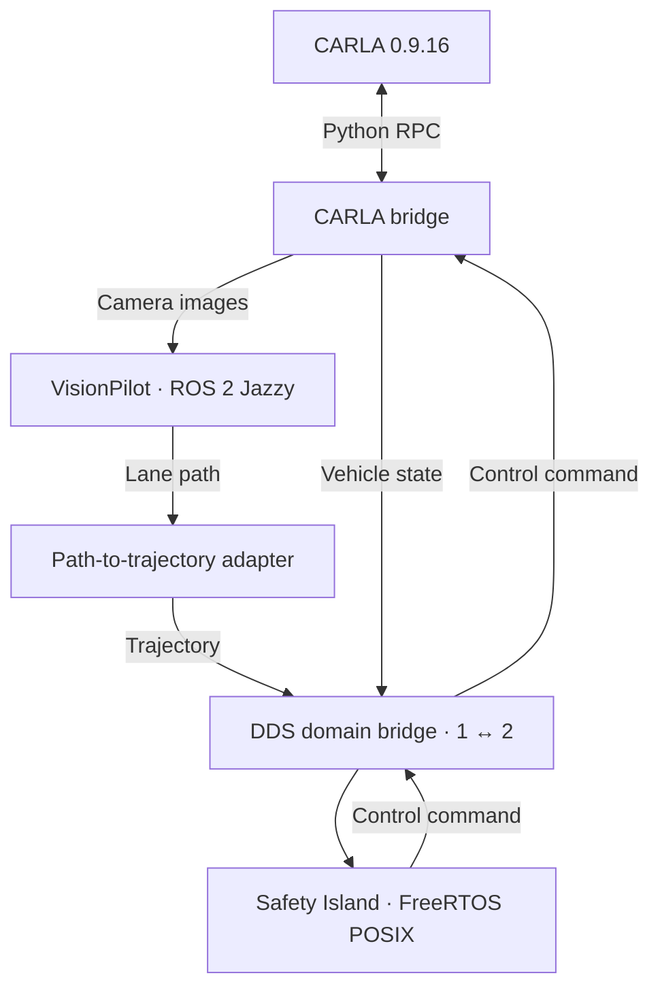

# openadkit-e2e

An Open AD Kit deployment for L2 closed-loop simulation:
**VisionPilot plans, Autoware Safety Island controls, and CARLA simulates.**

The stack runs with Docker Compose. This repo provides the deployment, configuration,
and adapter that connects VisionPilot's lane path to Safety Island's trajectory follower.

## How it works



Safety Island is the only controller; VisionPilot's steering and throttle commands
are not connected to CARLA. A scenario process creates the vehicle and sensors and
advances the simulation at a requested 20 Hz, with camera images at 10 Hz.

## Quick start

Use an Ubuntu x86-64 host with a working NVIDIA driver, Git, curl, and Python 3.10
with venv support (CARLA itself still requires an NVIDIA GPU; see
[compute mode](deploy/README.md#compute-mode-gpu-or-cpu) for CPU inference notes).
Run these commands from the repository root:

```bash
./deploy/setup.sh
# Log out and back in if setup asks you to.
./deploy/build.sh --dds-interface ens3
./deploy/run-loop.sh
```

Replace `ens3` with your multicast-capable network interface. The build script
initializes the required submodules and builds the stack.

Once the loop is ready, open the camera preview: <http://127.0.0.1:8090/>
(On a remote host, use the public-IP link printed by `run-loop.sh`.)

See the [deployment guide](deploy/README.md) for configuration, logs, and shutdown.

## Known limitations

### Lane changes at Town04 splits and merges

VisionPilot can switch between lanes at splits and merges, causing
weaving or Safety Island `too large yaw error` messages. An empty path produces
a stop trajectory, and the vehicle can remain stopped. The adapter does not
correct this path-selection limitation.

### Cross-distro, cross-RMW path subscription

The adapter subscribes to VisionPilot's `/vehicle/lane_path` directly across
the ROS distro (Jazzy to Humble) and RMW (FastDDS to CycloneDDS) boundary.
This was verified empirically for `nav_msgs/Path` at 10 Hz, including a full
closed loop, but ROS guarantees neither cross-distro nor cross-vendor
communication. If the adapter stops publishing trajectories while VisionPilot
is planning, suspect this boundary first (see also
[rmw_fastrtps#797](https://github.com/ros2/rmw_fastrtps/issues/797)). Unifying
both sides on CycloneDDS was tested and does not work (rmw 1.x vs 2.x string
deserialization mismatch), so keep VisionPilot on its default FastDDS.

### CARLA requires an NVIDIA GPU

There is no supported CPU rendering path. UE 4.26 is Vulkan-only (`-opengl`
is ignored), the bundled Mesa 21.2 lavapipe segfaults during init,
host-mounted Mesa 23 cannot load (glibc 2.32+ vs image 2.31), and
`-no-rendering` crashes the same way at startup. Even if it booted,
no-rendering returns empty camera data, which would blind the planner.

CPU inference tops out around 2.5 Hz on a 28-core EPYC (vs 10 Hz on GPU);
the loop stays correct because the scenario drives sim time. Measurements,
in order:

- ORT graph optimizations on CPU sessions gained ~20% (kept).
- INT8 weights were slower than fp32 in testing (1.8 vs 2.5 Hz on the same host,
  reverted — the test CPU lacks the VNNI instructions INT8 needs, so it could not
  be fairly evaluated).
- Pinning to 8/25/28 cores showed parallelism saturates early, so thread tuning has nothing to give.
- Skipping the unused autospeed model (~1/3 of DNN cost) was deliberately left out to avoid touching the planner.

All CPU figures above were measured on x86-64 (AMD EPYC); ARM CPU runs are
untested and pending.

## Next steps

See the [VP–SI integration plan](docs/vp-si-integration-plan.md) for the staged
implementation of VP command supervision, selectable SI control, and validated handover.

### ARM validation

- Validate CPU inference on ARM hosts, which are currently untested; record
  planning rate and loop behavior the same way the x86-64 figures above were measured.

### Remote / multi-host

- Add a `CARLA_HOST` knob so the scenario and bridge can target a remote CARLA
  server instead of the hardcoded `127.0.0.1`, and document the required
  DDS/network setup.

### Planner and inference

- Re-evaluate INT8 on a VNNI-capable CPU; current figures come from a CPU
  without the VNNI instructions INT8 needs.
- Revisit skipping the unused autospeed model (~1/3 of DNN cost) if planner
  changes allow it.

### Interoperability

- Harden lane selection at splits and merges; the adapter currently passes
  VisionPilot's path through uncorrected.
- Reduce reliance on the cross-distro (Jazzy ↔ Humble), cross-RMW
  (FastDDS ↔ CycloneDDS) path subscription once the string deserialization
  mismatch is resolved.

### Generalization

- Parameterize the town: the scenario currently hardcodes `Town04`
  (`deploy/nodes/scenario.py`); make it configurable and validate additional
  maps and spawn points.
- Extend NPC traffic scenarios beyond the current rig, which configures none
  (`deploy/config/carla-rig.json`).

## Repository

| Path                                                                                                              | Contents                                                        |
| ----------------------------------------------------------------------------------------------------------------- | --------------------------------------------------------------- |
| [`deploy/`](deploy/README.md)                                                                                     | Setup, build, Compose services, and runtime configuration       |
| [`adapter/`](adapter/path_to_trajectory.py)                                                                       | Lane path → Autoware trajectory conversion                      |
| [`upstream/vision_pilot`](https://github.com/oguzkaganozt/autoware_vision_pilot/tree/feat/lane-path)               | VisionPilot fork that publishes `/vehicle/lane_path`            |
| [`upstream/autoware-safety-island`](https://github.com/autowarefoundation/autoware-safety-island)                  | Pinned Safety Island submodule                                  |

CARLA uses the `carlasim/carla:0.9.16` container image and its Python API.
Native ROS integration (`--ros2`) is disabled.
