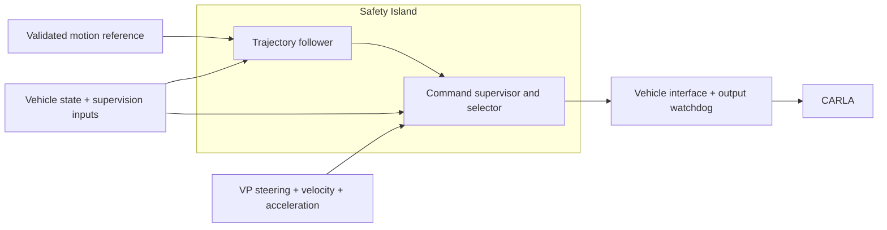

# VP–SI integration plan

**Status:** Proposed implementation plan; runtime behavior is not yet implemented.

## Objective

Keep VisionPilot's normal driving behavior, add command supervision, and —
only where justified — an alternative controller on the Safety Island.

Order of work:

1. **Supervise VP commands** without replacing normal control.
2. **Offer SI control as a selectable mode**, validated on its own.
3. **Add automatic handover** only for failures where it demonstrably helps.

Core rule: **who computes** a driving command and **who authorizes** it are
separate decisions. VP or the SI follower may compute; one supervisor owns the
single output in both modes.

## Current baseline

The deployment converts VP's `/vehicle/lane_path` into the odometry frame,
adds a nominal 3 m/s profile, and lets the SI trajectory follower drive the
CARLA bridge. VP's own steering and acceleration commands are published but
unused — so VP's lead-vehicle response and lateral behavior do not reach the
wheels.

Relevant code:

- [Path-to-trajectory adapter](../adapter/path_to_trajectory.py)
- [CARLA bridge and actuator mapping](../deploy/nodes/carla_bridge.py)
- [DDS routing](../deploy/config/bridge-config.yaml)
- [Compose deployment](../deploy/docker-compose.yaml)

The SI software provides a trajectory follower only. The supervisor and
source selection below require SI-side development, not topic rewiring.

## Target architecture

| Component | Responsibility |
| --- | --- |
| VP | Perception, nominal commands, motion-reference source for SI tracking |
| Reference adapter | Coordinate, timing, and trajectory conversion; reports invalid input, never invents policy |
| SI follower | Alternative lateral and longitudinal control |
| SI supervisor | Validity, limits, source selection, fallback |
| Vehicle interface | Physical-command conversion, last-mile timeout |

A host-side ROS guard may help early experiments but is not the target
supervisor and establishes no isolation or certification claim.

## Operating modes

| Mode | Nominal source | Final authority |
| --- | --- | --- |
| VP-primary | VP commands | SI supervisor |
| SI-primary | SI follower | SI supervisor |
| Stopping / stopped | Defined fallback | SI supervisor; vehicle watchdog on SI-output loss |

Select the mode before motion; reject requests with unready inputs or
controllers. Moving handover — including operator requests — belongs to
Phase 3. Shadow execution is an evaluation tool only, and continuous
dual-controller execution is required only if a takeover deadline demands it.

## Phase 0 — Comparison and interface contract

**Goal:** make behavior preservation measurable before changing control.

### Build

- Pin VP revision, models, config, vehicle, map, spawn points, and sim settings.
- Record the vanilla VP–CARLA actuator mapping. Run the direct VP baseline on
  the **current** bridge and record the delta to the supervised-path interface
  separately; the baseline must not wait for Phase 1.
- Define the command envelope: steering angle, **commanded velocity**,
  acceleration, source identity, source timestamp, sequence/epoch identity,
  validity. Velocity is mandatory — the actuator mapping consumes velocity
  together with acceleration. Specify units, signs, clocks, restarts, and
  **QoS (reliability, durability, depth)** for every envelope, candidate,
  approved, and reference topic across FastDDS/CycloneDDS and the bridge.
- Publish steering, velocity, and acceleration from the same VP planning cycle.
  Today's separate `Float64` messages carry no source timestamps or shared
  cycle ID, so arrival time cannot establish age. Map SI follower output to the
  same contract; never invent a fixed target speed for the VP path — VP-primary
  velocity must come from VP intent or a documented, validated derivation.
- Add a lead-vehicle/NPC rig and scenario step (the current rig configures no
  NPCs), or scope lead-vehicle acceptance to empty traffic explicitly.
- Set operating speeds and limits for latency, command age, tracking error,
  braking, and actuator changes **before** measuring.

### Accept

- Baseline reproducible, including curves and lead-vehicle braking.
- Signs, units, saturation, and actuator response verified; every command
  traceable from source cycle to application.

## Phase 1 — Supervise VP

**Goal:** pass valid VP commands through, enforce one supervision path.

### Build

- Add the supervisor path to the SI runtime. VP-primary must not need the
  follower or a trajectory.
- Give candidate and approved commands distinct endpoints; the bridge consumes
  approved output only, and no other publisher may feed the actuator input.
  Follower computation must not block supervisor deadlines.
- Validate commands and vehicle state: age, finite values, physical limits.
  Define per-violation responses (reject, bound, stop); never clip steering
  and acceleration independently. Gate actuation state with the same staleness
  rule as telemetry — mapping and state-loss braking must not use stale speed
  or steering.
- Watchdog: enforce source timestamp/sequence and a maximum command age at the
  actuation input, so stale-arriving output cannot pass as fresh; handle
  fail-active/babbling supervisors, not just silence. Adopt the existing 0.5 s
  control timeout as the normative age bound and minimum publish rate.
- Pass valid in-envelope VP commands unchanged; never route them through the
  fixed-speed adapter.
- Define stopping/stopped states, activation, and explicit re-enable rules. A
  fallback must not assume failed measurements.
- Log requested/applied commands, source, reason, input ages, decision times.
- Build the fault-injection harness first: delay, drop, reorder, restart,
  invalid input, supervisor-output loss.

**No cruise fallback:** losing VP intent never means returning to 3 m/s. The
fallback is a defined stopping response.

### Accept

- Without intervention, approved output matches VP candidates within Phase 0 limits.
- Each injected fault produces its specified response, including watchdog actuation.
- No bypass route exists; stop/hold/re-enable verified; false interventions counted.
- Limit checks alone claim no collision avoidance.

## Phase 2 — Selectable SI control

**Goal:** a tested SI-primary alternative; still no moving handover.

### Build

- Contract the motion reference: geometry, frame, acquisition time, validity
  horizon, consistent speed/acceleration profiles.
- Prefer VP's own speed horizon; reconstructing a reference from instantaneous
  acceleration is an approximation that must be validated, not assumed.
- Allow zero speed and stopping; re-check minimum-speed behavior, point/byte
  budget, and horizon against the speed range.
- Mode selected before motion; both modes share supervisor and interface.
- Shadow runs feed the idle controller measured state plus actual actuation —
  merely running its solver proves nothing about takeover readiness.

### Accept

- SI-primary evaluated on tracking, curves, following, braking, stopping,
  restart-from-rest; latency, errors, distances, rates, cost, and interventions
  reported against Phase 0 limits.
- Invalid references cannot activate SI-primary; differences documented, not
  equivalence claimed. Density alone proves nothing.

## Phase 3 — Justified handover

**Goal:** switch control only when the alternative is ready and better for a
specified failure.

### Build the failure matrix first

| Condition | Response |
| --- | --- |
| No valid reference yet at startup | Inhibit actuation until reference and controller are valid; bridge takes approved output only |
| VP command fails, valid reference and state remain | SI takeover if ready and validated; the reference needs an independent validity test and must not reuse VP's failed perception chain (CIPO, acceleration, FCW/AEB warnings share one) |
| VP perception or reference invalid | Fallback; never continue on the same reference |
| Required vehicle state lost | No tracking takeover; state-loss braking without stale feedback |
| SI follower fails in SI-primary | Return to VP only if its commands, readiness, and the transition are validated; else fallback |
| Supervisor output lost | Vehicle-interface watchdog |

Then: bounded transitions with initialized controller state, hysteresis and
hand-back rules against flapping, warm-standby vs on-demand chosen by measured
readiness vs required latency. The supervisor owns output throughout. Takeover
may stay disabled where it shows no benefit.

### Accept

- Every enabled transition has a reproducible trigger and a measured benefit
  over the Phase 1 fallback; discontinuities and latency within agreed limits.
- Ineligible takeovers, repeated faults, and recovery never flap sources;
  shared-input failures distinguished from controller failures.

## Environmental supervision

Obstacle-aware intervention needs its own inputs; it does not come free with
controller selection.

1. Define scenarios and data: ego state, obstacle position/motion, corridor,
   uncertainty, observation age.
2. Develop against CARLA ground truth, but keep privileged-information results
   separate from VP-only comparisons.
3. VP CIPO/warnings share one dependency chain — not independent channels. Add
   them only through a documented interface.
4. Count missed interventions **and** unnecessary braking; state what the
   monitor covers and what it does not.

Build this after the approved-output path exists. Stopping for an obstacle is
not path planning around it; this plan adds no lateral avoidance planner.

## Implementation areas

| Area | Work |
| --- | --- |
| VP fork | Timestamped coherent command publication; reference/perception exports |
| SI fork | Supervisor path, selection, fallback, readiness, transitions |
| `adapter/` | SI-primary reference conversion and tests |
| `deploy/nodes/carla_bridge.py` | Common contract, approved-output input, watchdog, applied-command feedback |
| `deploy/config/bridge-config.yaml` | Candidate/approved routing with explicit domains and `from_domain`/`to_domain` |
| Compose, build/start scripts | Message support, mode selection, startup readiness, submodule pins |
| Scenario and tooling | Reproducible baseline, fault injection, comparison reports |

Fork changes stay in their forks; this repo pins revisions. Hard constraints
for every newly bridged message: the 1200 B adapter budget and domain-2
`MaxMessageSize 1400B` / `FragmentSize 1344B` — state each topic's domain and
keep serialized sizes inside budget.

## Completion criteria

1. **Preservation:** VP-primary matches baseline within stated limits.
2. **Supervision:** selected invalid-command and communication failures get
   documented, bounded responses.
3. **Alternative control:** SI-primary meets its tracking and stopping criteria.
4. **Handover:** each enabled transition provably improves its failure response.

None of this establishes certification, hardware isolation, or general driving
safety. The deliverable is a measured integration with explicit
responsibilities, supported scenarios, and known limits.
