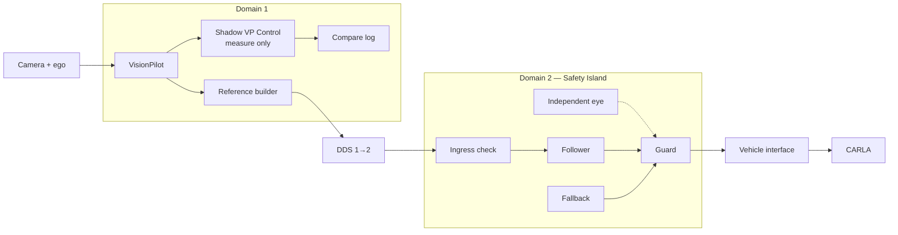

# VP–SI integration plan

**Status:** Proposed. Not implemented yet.

## Idea in one line

**VP → SI → GUARD → CARLA.**

- VP produces intent (where to go, how fast, when to stop).
- SI drives (follower computes control).
- Guard authorizes (follower output or local fallback).
- CARLA receives only approved output.

One nominal driver: the follower. The fallback (MRM) is not a second
driver, it is the emergency answer: stop and hold.

## Today

- Adapter converts `/vehicle/lane_path` to odometry frame and adds a fake
  `3 m/s` speed.
- VP steering / acceleration are published but never used.
- Result: only lane shape reaches the wheels. Speed intent is lost.

Code:

- [Path-to-trajectory adapter](../adapter/path_to_trajectory.py)
- [CARLA bridge](../deploy/nodes/carla_bridge.py)
- [DDS routing](../deploy/config/bridge-config.yaml)
- [Compose](../deploy/docker-compose.yaml)

SI today is only a follower (MPC + PID). Guard, watchdog, and fallback
are new SI work. Follower logic does not change role.

Problems that must be fixed first:

1. VP lead-speed meaning is unclear (relative vs absolute).
2. SI keeps using old input forever (no freshness check).
3. Stop path has 2 points, MPC needs at least 3.
4. Steering / accel messages have no timestamp or cycle ID.
5. 33.3 m/s config vs 25 m path length does not fit physics.
6. Bridge ignores message age, logs queued as applied, reuses last
   steering on sensor loss.
7. Anyone can publish the control topic (no publisher lock).

## Target



| Part | Does | Does not do |
| --- | --- | --- |
| VP | Lane, speed horizon, stop intent. Timestamped. | Never sends actuator commands. |
| Reference builder | Clean trajectory: shape + speed + stops. | Never invents speed or policy. |
| Shadow | Only for comparison with SI, into a dedicated log/topic. | Never drives; bridge never subscribes to it. |
| Ingress check | Drops old / bad input. | Does not drive. |
| Follower | Normal driving. | Does not handle its own failure. |
| Guard | Picks follower or fallback. Checks limits. | No crash-avoidance claim while blind. |
| Fallback | Comfortable stop or emergency stop + hold. | Not a second normal driver. No pull-over. |
| Independent eye | Extra obstacle input to guard only. | Never goes to follower. |
| Vehicle interface | Converts commands, final timeout, reports what was really applied. | Does not guess missing data. |

Rules:

- Flow is one-way: VP → reference → follower → guard → vehicle.
- No valid input = stop and hold. Never fake cruise, never replay.
- No guessing VP speed from one acceleration sample. VP must export its
  own speed horizon.
- Blind guard = stop on bad data, not crash avoidance.

## Phase 0 — Measure first

Build:

- Pin versions, maps, spawn points, sim settings, random seeds.
- Run vanilla VP baseline with a throwaway shim on a dedicated shadow
  topic/log that the bridge never subscribes to, then throw it away.
- Fix VP lead-speed definition + tests.
- Define message contract: units, signs, frames, clocks, restarts, QoS
  (reliability, durability, depth per topic across FastDDS/CycloneDDS).
  Signs matter (steer / yaw negation); velocity is mandatory because the
  bridge consumes velocity + acceleration together.
- Pick wire layout: 13 points are already ~1172 B, so choose fewer
  points, bigger budget, or metadata on a side topic. Hard limits:
  Domain-2 `MaxMessageSize 1400B` / `FragmentSize 1344B` — anything near
  1400 B still fragments. Decision rule: maximize points that fit under
  1200 B including metadata; if the horizon needs more, raise the budget
  with measured fragmentation cost instead of silently crossing 1344 B.
  Keep a per-topic domain + serialized-size table.
  - DECIDED: raise the trajectory budget to 1300 B, keep 13 points, embed
    ~40 B of metadata (source ID, boot epoch + sequence, acquisition stamp,
    validity deadline, reason/status) in the trajectory. Projected total
    ~1212 B — under the 1344 B fragment limit with 132 B margin.
- Use camera-time-aligned odometry; receiver clock for timeouts.
- Add NPC cars, or limit tests to empty roads explicitly.
- Set low-speed test limit. Derive the age timeout from measurement,
  do not copy 0.5 s blindly.

Done when: baseline repeats, every command is traceable, wire layout
is fixed.

Do not start Phase 1 until lead-speed is fixed.

## Phase 1 — Rich path

Build:

- Adapter becomes a real reference builder: shape from lane path, speed
  from VP horizon, stops from empty / invalid input.
- Stop path must have at least 3 points with zero end speed and
  physically consistent speed/accel shape (count alone is not a stop),
  and cover cold start and valid → empty change.
- Add ingress check now: age, sequence, bad-shape rejection, clear
  old state. No endless driving on stale input.
- Fault tests: late, dropped, reordered, restarted, bad shape.

Done when: lead-car braking works through SI, curves work, restart
from standstill works, every fault gives its defined answer.

Do not start Phase 2 until stops work and ingress closes stale driving.

## Phase 2 — Guard + fallback

Inside the guard:

```text
health → availability → pick one → limit check → output
[fresh follower | comfortable | emergency]
```

Who writes what:

- Fresh: follower writes `Control`.
- Comfortable: fallback writes a stop path, follower executes it.
  Allowed only while follower is live (fresh output inside its timeout,
  finite values, limits ok) and ego is healthy. If the fault is the
  follower itself (stale / babbling / invalid), skip comfortable and go
  straight to emergency.
- Emergency: fallback writes `Control` directly.
  Used when follower path is unusable or comfortable activation fails.

Build:

- Guard + fallback in SI. Comfortable can only go down to emergency,
  never back up while the fault stays.
- Hold after stop. Explicit re-enable only. If ego itself failed,
  stay held until ego is healthy + re-enable.
- Bridge listens only to approved output. Enforcement, not just audit:
  remove the raw follower `Control` input from Domain-1 routing in
  `bridge-config.yaml` so the bridge cannot subscribe to it; startup check
  + CI routing audit are the backstop. Sim scope only — real hardware needs
  DDS security / ownership (separate spec).
- Coupled limits only. Never clip steering and accel separately.
- Check age with source stamp + sequence. Handle babbling, not only
  silence. Gate actuation state with the same staleness rule as telemetry:
  never drive mapping or braking on stale speed / steering.
- No motion until valid input + ready controller, including startup.
- Log wanted vs applied, reason, ages. Count false stops.

Done when: normal driving passes through untouched, every fault
(including babbling and guard-output loss) gives its defined answer,
no hidden bypass in sim scope (routing + startup check + audit),
hold / re-enable proven.

Still no crash-avoidance claim here. Same-chain checks cannot confirm
perception truth.

## Phase 3 — Independent eye

Start early as a spike during Phase 2, finish after the guard path works.

- Define cases: ego, obstacle motion, corridor, uncertainty, data age.
- Train on CARLA truth, but report privileged results separately.
- CIPO and warnings are one chain, not two independent votes.
- Count misses and false brakes. Write what is covered and what is not.
- Same camera / same host is not independence.

Needed for any crash-avoidance claim. Not needed for plain fail-stop.
No sideways avoidance planner in this plan. VP has none either.

## Later

- Extra VP exports (warnings, CIPO, horizon) in the VP fork.
- More towns / NPC cases.
- VP as backup driver only with independent sensing, arbitration, and
  bumpless handover proof. Until then VP Control stays shadow.

## Who builds what

| Area | Work |
| --- | --- |
| VP fork | Fix lead-speed, timestamped horizon export |
| SI fork | Ingress, guard, fallback; follower role unchanged |
| `adapter/` | Rich reference, valid stops, tests |
| `carla_bridge.py` | Approved input only, watchdog, real applied feedback |
| `bridge-config.yaml` | Domains, routing, publisher lock |
| Compose / scripts | Startup block until ready, pinned versions |
| Tests | Baseline, fault injection, shadow comparison, miss + false counts |

Fork changes stay in their forks; this repo only pins revisions.

## Done when

1. Fake 3 m/s cruise is gone; intent driving matches baseline in limits.
2. Bad input / lost comms give bounded stops, false stops counted.
3. Independent eye covers its stated cases, misses + false brakes counted.
4. Differences, delays, and stop costs measured. Age limit measured,
   not copied.

This gives no certificate, no hardware isolation, no general safety.
It gives a measured integration with clear duties and known limits.
