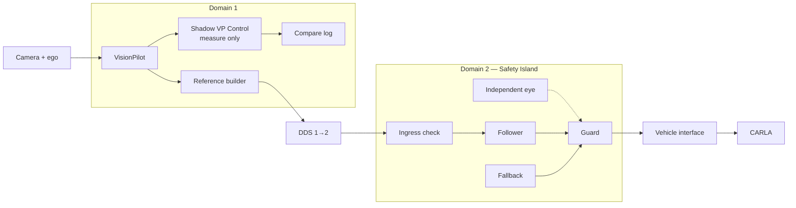

# VP–SI integration plan

**Status:** Phase 1 (reference + ingress) and Phase 2 (SI-native guard) are in
tree. Phase 3 is not.

## Idea in one line

**VP → SI → GUARD → CARLA.**

- VP produces intent (where to go, how fast, when to stop).
- SI drives (follower computes control).
- Guard authorizes (follower output or local fallback).
- CARLA receives only approved output.

One nominal driver: the follower. The fallback (MRM) is not a second
driver, it is the emergency answer: stop and hold.

## Today

Closed loop in this repo: VisionPilot plans, Safety Island controls, CARLA
simulates. VP steering is not wired to CARLA.

- Adapter converts `/vehicle/lane_path` (`base_link` → `map`) and transcribes
  `/vehicle/speed_horizon`. Default is VP speed. `CRUISE_OVERRIDE_MPS` is the
  A/B flat-cruise knob (still requires fresh odom).
- Trajectory budget: 13 points, 25 m, ≤1300 B. Domain 2
  `MaxMessageSize 1400B` / `FragmentSize 1344B`. No extra metadata on the
  wire (`Float32MultiArray` has no sequence; ingress is arrival-age only).
- Ingress lives in the adapter (SI latches `has_trajectory_`). Stale/missing
  horizon or odom, empty path, bad shape, or a 1 s path watchdog each publish
  a 3-point 0 m/s stop (`STALE_INPUT_MS=1000`, measured, not a copied 0.5 s).
- SI follower is unchanged (MPC + PID). Native guard is compiled into
  `actuation_freertos`: `INIT → FRESH ↔ COMFORTABLE → EMERGENCY → HOLD → FRESH`.
  `GUARD` / `MODE` as in the [main README](../README.md#phase-2-guard-native-in-safety-island).
  HOLD needs `/guard/re_enable`. SI death is the bridge 0.5 s receive-time
  timeout.
- Bridge maps SI velocity + acceleration to throttle/brake, drops stale CARLA
  samples (0.2 s). Steering status is last measured wheel angle, or 0 until
  the first successful read. Control timeout is last-receive, not
  `Control.stamp`.
- Default rig (`carla-rig.json`): Town04 spawn 184, lead at `cruise_mps`, plus
  NPCs. Empty-road A/B uses `RIG_JSON=carla-rig-empty.json`.

Code:

- [Path-to-trajectory adapter](../deploy/nodes/path_to_trajectory.py)
- [CARLA bridge](../deploy/nodes/carla_bridge.py)
- [Scenario](../deploy/nodes/scenario.py)
- [DDS routing](../deploy/config/bridge-config.yaml)
- [Compose](../deploy/docker-compose.yaml)

Known limits that still bound the loop (detail in the
[main README](../README.md#known-limitations)): VP’s own steering is not a
CARLA baseline; CIPO is range-dependent (close-range blindness); lateral
cold-start noise; splits/merges; Jazzy/Humble + FastDDS/CycloneDDS path
subscription.

## Target

| Part | Does | Does not do |
| --- | --- | --- |
| VP | Lane, speed horizon, stop intent. | Never sends actuator commands. |
| Reference builder | Clean trajectory: shape + speed + stops. | Never invents speed or policy. |
| Shadow | Only for comparison with SI, into a dedicated log/topic. | Never drives; bridge never subscribes to it. |
| Ingress check | Drops old / bad input. | Does not drive. |
| Follower | Normal driving. | Does not handle its own failure. |
| Guard | Picks follower or fallback. Checks limits. | No crash-avoidance claim while blind. |
| Fallback | Comfortable stop or emergency stop + hold. | Not a second normal driver. No pull-over. |
| Independent eye | Extra obstacle input to guard only. | Never goes to follower. |
| Vehicle interface | Converts commands, final timeout, reports what was really applied. | Does not guess missing data. |

Rules:

- Flow is one-way: VP → reference → follower → guard → vehicle.
- No valid input = stop and hold. Never fake cruise, never replay.
- No guessing VP speed from one acceleration sample. VP must export its
  own speed horizon.
- Blind guard = stop on bad data, not crash avoidance.

## Phase 0 — Measure first

**Partial.** Pins, map, spawn, and wire size are in tree. Lead-speed meaning
and command traceability are not done.

| Item | State |
| --- | --- |
| Image pins, Town04, spawn 184, `SPAWN_INDEX` | In tree (`config.env`, scenario, rig JSON) |
| VP steering as a CARLA baseline | Abandoned — not usable; A/B is SI+VP speed vs SI+3 m/s |
| Lead-speed definition + tests | Open — CIPO still flickers / goes blind close-range |
| Trajectory 13 pts / 25 m / 1300 B | In tree. Decided metadata (~40 B) is **not** on the wire |
| Ingress age from measurement | Adapter 1000 ms from healthy 50–270 ms samples |
| Bridge control timeout | Still 0.5 s receive-time (SI-death watchdog), not stamp age |
| Camera-time-aligned odometry | Open — image and odom use independent `now()` stamps |
| NPC vs empty road | Both: default rig lead+NPCs; `carla-rig-empty.json` for A/B |

## Phase 1 — Rich path

**In tree** (adapter), with the age-only amendment.

Done:

- Shape from lane path, speed from VP horizon, stops from empty / invalid
  input. 3-point zero-speed stop with consistent accel.
- Ingress: arrival age, bad shape, watchdog, clear zombie horizon. Override
  ignores horizon only.
- Fault unit tests: late, dropped, restarted, bad shape.

Not done (left on purpose or still open):

- Sequence / reorder / boot-epoch — no seq on `Float32MultiArray`; policy is
  age-only by design.
- Lead-car braking as a reliable VP perception path — pipeline transcribes
  intent; CIPO close-range is still a VP limit (see README).

## Phase 2 — Guard + fallback

**In tree** inside SI. Vehicle-interface leftovers stay on the bridge.

Done:

- Guard + fallback in `actuation_freertos` (`guard_policy.hpp`). Comfortable
  and emergency publish brake `Control` on
  `/control/trajectory_follower/control_cmd`. HOLD + `/guard/re_enable`.
- `MODE=run|autoware|stop`, `GUARD` POSIX override. Coupled envelope as in
  the README.
- Bridge 0.5 s silence timeout for SI death. Steering status not guessed
  from the last command.

Not done:

- Control `stamp` / sequence / babbling (only last-receive timeout).
- Log wanted vs applied at `apply_control` (today the “applied” log is the
  queue).
- Publisher lock on the control topic.
- Hardware DDS security / ownership (sim scope only).

Still no crash-avoidance claim. Same-chain checks cannot confirm perception
truth.

## Phase 3 — Independent eye

**Not started.** Needed for any crash-avoidance claim. Not needed for plain
fail-stop.

- Define cases: ego, obstacle motion, corridor, uncertainty, data age.
- Train on CARLA truth, but report privileged results separately.
- CIPO and warnings are one chain, not two independent votes.
- Count misses and false brakes. Write what is covered and what is not.
- Same camera / same host is not independence.

No sideways avoidance planner in this plan. VP has none either.

## Later

- Extra VP exports (warnings, CIPO, horizon) in the VP fork.
- More towns / richer NPC cases.
- VP as backup driver only with independent sensing, arbitration, and
  bumpless handover proof. Until then VP Control stays unwired.

## Who builds what

| Area | In tree | Remaining |
| --- | --- | --- |
| VP fork | `/vehicle/lane_path`, speed horizon, CIPO latch | Lead-speed contract, close-range detection |
| SI fork | Follower, native guard/fallback, `GUARD`/`MODE` | — |
| `path_to_trajectory.py` | Reference + age ingress + 3-point stop | Sequence/metadata if the wire ever grows it |
| `carla_bridge.py` | Timeout, stale-sample gate, no guessed steer | Stamp age, wanted-vs-applied log |
| `scenario.py` | Town04, lead `cruise_mps`, NPCs, lead brake | Configurable town |
| `bridge-config.yaml` | Domain 1↔2 routing, `/guard/re_enable` | Publisher lock |
| Compose / scripts | Pinned images, startup waits, log caps | — |
| Tests | Adapter faults, longitudinal/steer/TM mapping | Shadow comparison, miss + false counts |

Fork changes stay in their forks; this repo only pins revisions.

## Done when

1. Fake 3 m/s cruise is gone as the default — **met** (horizon default;
   override is A/B only).
2. Bad input / lost comms give bounded stops, false stops counted —
   **met for adapter ingress**; SI-output loss is still the 0.5 s bridge
   timeout.
3. Independent eye covers its stated cases, misses + false brakes counted —
   **Phase 3, not started**.
4. Differences, delays, and stop costs measured. Age limit measured,
   not copied — **partial** (adapter 1000 ms measured; bridge 0.5 s still
   copied).

This gives no certificate, no hardware isolation, no general safety.
It gives a measured integration with clear duties and known limits.
