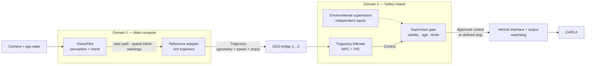

# VP–SI integration plan

**Status:** Proposed implementation plan; runtime behavior is not yet implemented.

## Objective

VisionPilot plans, the Safety Island drives. Intelligence comes from VP;
every actuator command is computed on the SI side — either by the trajectory
follower from a valid reference, or by the defined stopping response when no
valid reference exists. Nothing invents motion.

There is no controller selector, no primary-mode menu, and no automatic
handover between drivers, because there is only one driver. Supervision means
one gate authorizing or refusing that driver's output — never a second driver
waiting to be picked.

## Current baseline

The deployment converts VP's `/vehicle/lane_path` into the odometry frame,
adds a nominal 3 m/s profile, and lets the SI trajectory follower drive the
CARLA bridge. VP's own steering and acceleration commands are published but
unused — so VP's lead-vehicle response and lateral behavior do not reach the
wheels. Of VP's six intelligence products (lane geometry, lead estimate, speed
and brake intent, warnings, steering computation, speed management), only lane
geometry survives today.

Relevant code:

- [Path-to-trajectory adapter](../adapter/path_to_trajectory.py)
- [CARLA bridge and actuator mapping](../deploy/nodes/carla_bridge.py)
- [DDS routing](../deploy/config/bridge-config.yaml)
- [Compose deployment](../deploy/docker-compose.yaml)

The SI software provides a trajectory follower only. The gate below requires
SI-side development, not topic rewiring.

## Target architecture

| Component | Responsibility |
| --- | --- |
| VP | Perception and driving intent: lane geometry, speed and brake intent, lead estimate, warnings |
| Reference adapter | Intent-to-contract translation: rich trajectory with consistent speed and stop profiles; reports invalid input, never invents policy |
| SI follower | The only lateral and longitudinal control computation |
| Supervisor gate | Authorizes or refuses follower output; enforces validity, age, and limits; triggers defined stop |
| Environmental supervision | Independent-obstacle input to the gate; feeds the gate only, never the control path |
| Vehicle interface | Physical-command conversion, last-mile timeout |

A host-side ROS guard may help early experiments but is not the target gate
and establishes no isolation or certification claim.

## Operating principle

- Intelligence flows one way: VP → reference → follower → gate → vehicle.
- VP never signs an actuator message; the signature on every `Control` output
  belongs to the SI side.
- No valid reference means no driving: the fallback is a defined stopping
  response, never an invented cruise speed and never replay of an old command.
- VP's steering solver stays deliberately unused. Its input — the lane
  polynomial — already reaches the wheels through the SI MPC, so running a
  second solver would duplicate computation, not add information.

## Phase 0 — Comparison and interface contract

**Goal:** make behavior preservation measurable before changing control.

### Build

- Pin VP revision, models, config, vehicle, map, spawn points, and sim settings.
- Record the vanilla VP–CARLA actuator mapping. Run the direct VP baseline on
  the **current** bridge — via a throwaway VP→`Control` shim that is measured
  and then discarded — and record the delta to the new reference path
  separately; the baseline must not wait for Phase 1.
- Define the reference contract: geometry, frame, acquisition time, validity
  horizon, and physically consistent speed/acceleration profiles including
  zero speed and stopping. Velocity is mandatory — the actuator mapping
  consumes commanded velocity together with acceleration. Specify units,
  signs, clocks, restarts, and **QoS (reliability, durability, depth)** for
  every reference, control, and supervision topic across FastDDS/CycloneDDS
  and the bridge.
- Export VP intent with source timestamps and a shared cycle identifier.
  Today's separate `Float64` messages carry neither, so arrival time cannot
  establish age. Prefer VP's own speed horizon over reconstructing one from
  instantaneous acceleration: a single acceleration sample does not reproduce
  its lead-vehicle prediction across a horizon.
- Add a lead-vehicle/NPC rig and scenario step (the current rig configures no
  NPC vehicles), or scope lead-vehicle acceptance to empty traffic explicitly.
- Set operating speeds and limits for latency, command age, tracking error,
  braking, and actuator changes **before** measuring.

### Accept

- Baseline reproducible, including curves and lead-vehicle braking.
- Signs, units, saturation, and actuator response verified; every command
  traceable from source cycle to application.

## Phase 1 — Rich reference

**Goal:** carry VP's intent — geometry, speed, braking, stopping — to the SI
follower. This is the phase that answers the original objection.

### Build

- Extend the adapter into a reference builder: lane geometry from
  `/vehicle/lane_path`, speed intent from VP's acceleration output and vehicle
  state, stop encoding from invalid/empty paths. Keep the 1200 B budget, the
  25 m extent discipline, and the existing frame conventions; re-check
  minimum-speed behavior, point budget, and usable horizon against the new
  speed range including rest.
- Prefer exporting VP's internally computed speed horizon where feasible.
  Treat acceleration-to-profile reconstruction as an approximation requiring
  validation against that horizon: one instantaneous acceleration value does
  not reproduce VP's lead-vehicle prediction across a horizon.
- Keep the empty-path stop trajectory. Losing VP intent must never fall back
  to cruise: no reference means the defined stopping response.
- Build the fault-injection harness first: delayed, dropped, reordered, and
  restarted reference input; invalid geometry; supervisor-output loss.

### Accept

- Lead-vehicle slowdown and stopping from VP intent reproduced through SI
  within Phase 0 limits; curves tracked; restart-from-rest demonstrated.
- Each injected reference fault produces its specified response.
- The report documents behavior differences against vanilla VP–CARLA driving
  instead of claiming identical control; point density alone proves nothing.

## Phase 2 — Supervisor gate

**Goal:** one gate authorizing or refusing follower output; no second driver.

### Build

- Add the gate to the SI runtime. The bridge consumes approved output only;
  no other publisher may feed the actuator input.
- Validate follower output and vehicle state: source age, finite values,
  physical limits. Define per-violation responses (reject, bound, stop);
  never clip steering and acceleration independently. Gate actuation state
  with the same staleness rule as telemetry — mapping and state-loss braking
  must not use stale speed or steering feedback.
- Watchdog: enforce source timestamp/sequence and a maximum command age at the
  actuation input, so stale-arriving output cannot pass as fresh; handle
  fail-active/babbling output, not just silence. Adopt the existing 0.5 s
  control timeout as the normative age bound and minimum publish rate.
- Define stopping/stopped states, activation, and explicit re-enable rules. A
  fallback must not assume failed measurements.
- Inhibit actuation until a valid reference and a ready controller exist,
  including at startup; the bridge takes approved output only.
- Log requested/applied commands, source, reason, input ages, decision times;
  count false interventions.

### Accept

- Without intervention, approved output matches follower output within
  Phase 0 limits.
- Each injected fault — including stale and babbling output — produces its
  specified response, including watchdog actuation.
- No bypass route exists; stop/hold/re-enable verified.
- Limit checks alone claim no collision avoidance. The gate cannot validate
  perception truth from the same chain that produced it, so no validity test
  may treat same-chain signals as independent confirmation; that requires the
  independent inputs of Phase 3.

## Phase 3 — Environmental supervision

**Goal:** give the gate an independent eye. This is a separate capability,
not a byproduct of controller choice.

1. Define scenarios and data: ego state, obstacle position/motion, corridor,
   uncertainty, observation age.
2. Develop against CARLA ground truth, but keep privileged-information results
   separate from VP-only comparisons.
3. VP CIPO and its derived warnings share one dependency chain — not
   independent channels. Add them only through a documented interface, and
   never treat them as confirming each other.
4. Count missed interventions **and** unnecessary braking; state what the
   monitor covers and what it does not.

Build this after the approved-output path exists. Stopping for an obstacle is
not path planning around it; this plan adds no lateral avoidance planner —
neither does VP itself.

## Later, only if justified

- VP-side exports (warnings, CIPO) through documented interfaces, in the VP fork.
- Town parameterization and NPC scenarios (see Generalization in the main
  README). Neither changes the architecture above.

## Implementation areas

| Area | Work |
| --- | --- |
| VP fork | Timestamped coherent intent publication; reference/perception exports |
| SI fork | Gate path, fallback, readiness; follower unchanged in role |
| `adapter/` | Rich-reference conversion and tests |
| `deploy/nodes/carla_bridge.py` | Common contract, approved-output input, watchdog, applied-command feedback |
| `deploy/config/bridge-config.yaml` | Reference/control routing with explicit domains and `from_domain`/`to_domain` |
| Compose, build/start scripts | Message support, startup readiness, submodule pins |
| Scenario and tooling | Reproducible baseline, fault injection, comparison reports |

Fork changes stay in their forks; this repo pins revisions. Hard constraints
for every newly bridged message: the 1200 B adapter budget and domain-2
`MaxMessageSize 1400B` / `FragmentSize 1344B` — state each topic's domain and
keep serialized sizes inside budget.

## Completion criteria

1. **Preservation:** intent-carrying driving matches the VP baseline within
   stated limits; the fixed 3 m/s cruise is gone.
2. **Supervision:** selected invalid-command and communication failures get
   documented, bounded responses.
3. **Alternative perception for the gate:** environmental supervision covers
   its specified scenarios with counted misses and false interventions.
4. **Known limits:** behavior differences, latencies, and availability costs
   (including SI-fault stops) are measured and stated.

None of this establishes certification, hardware isolation, or general driving
safety. The deliverable is a measured integration with explicit
responsibilities, supported scenarios, and known limits.
